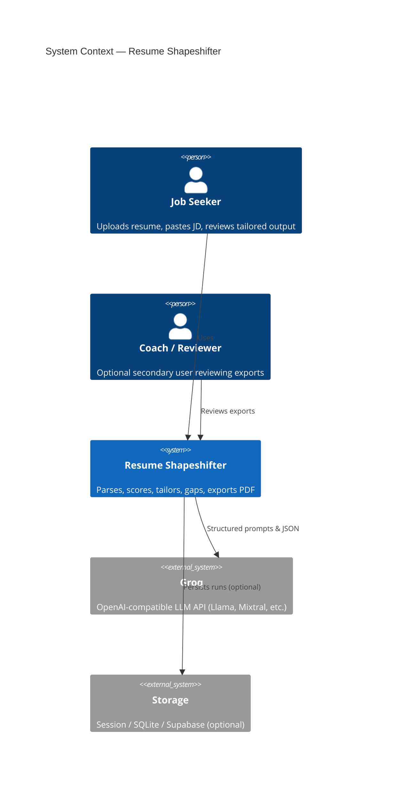
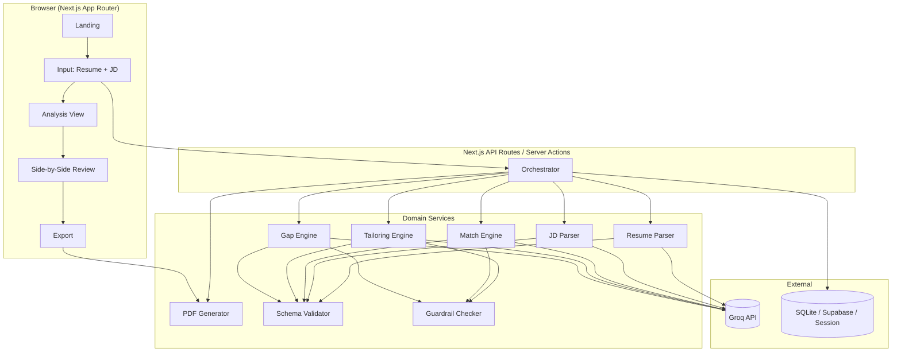
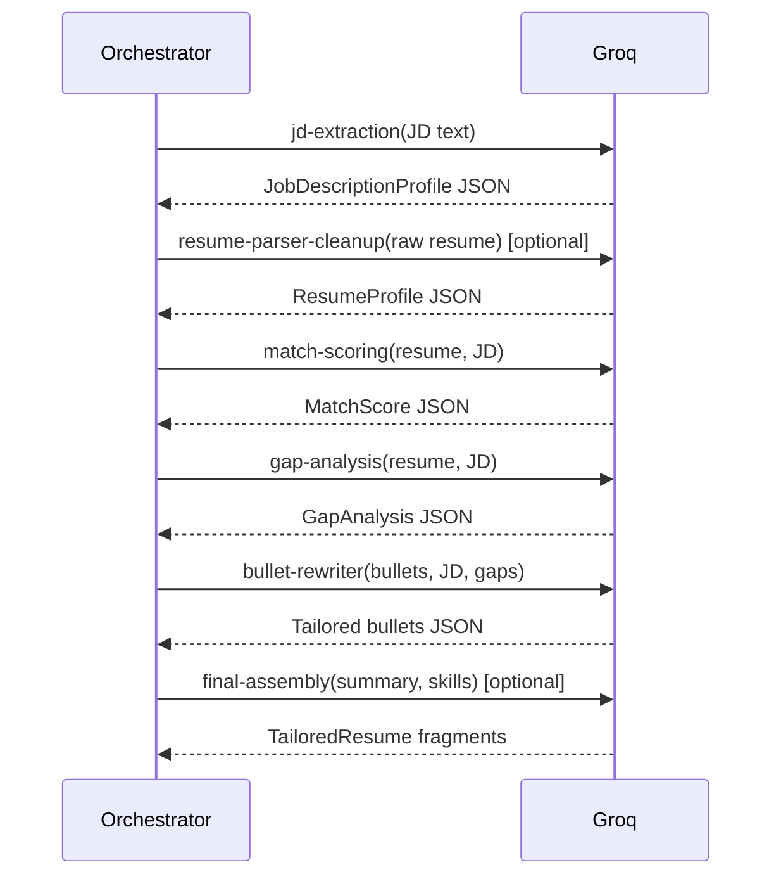
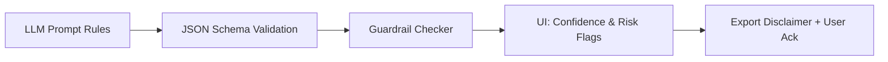
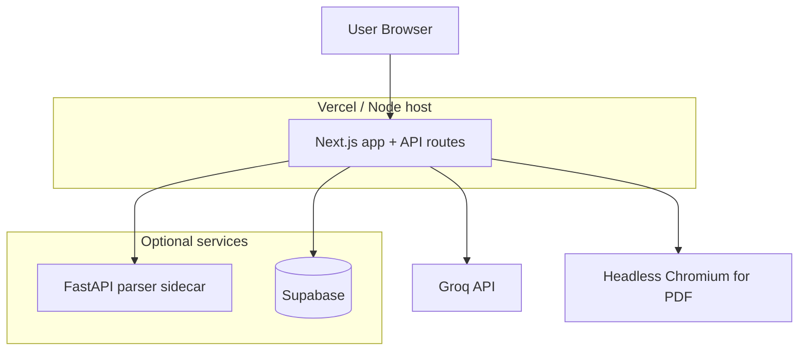
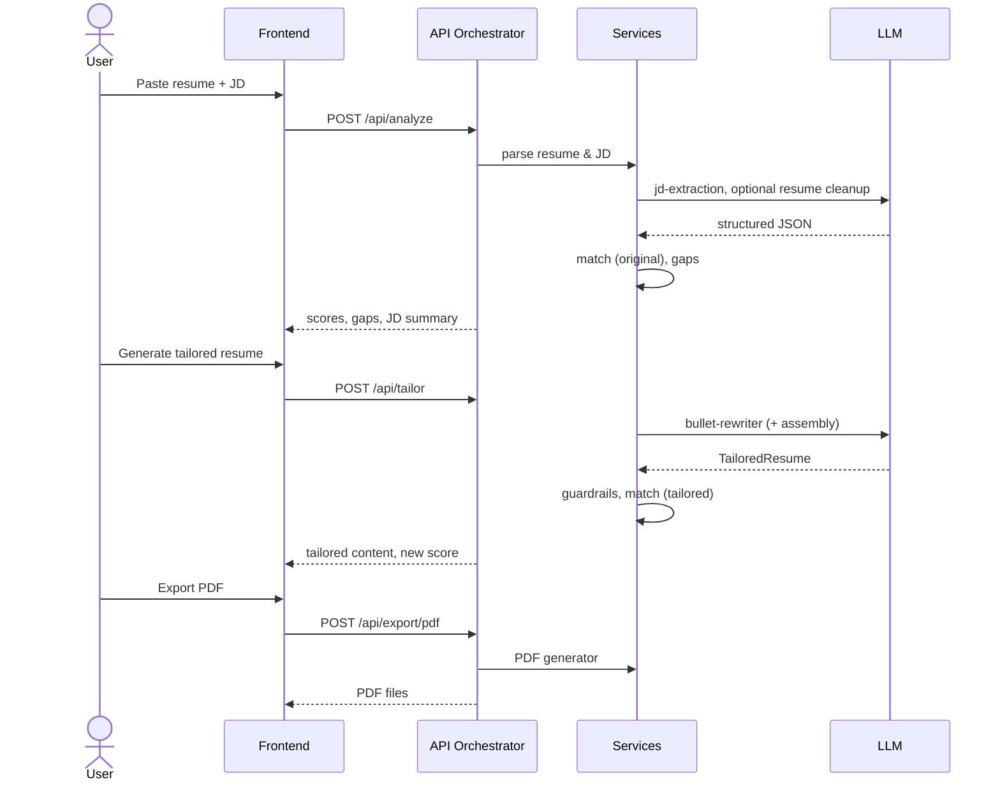

# Resume Shapeshifter — System Architecture

This document describes the technical architecture for **Resume Shapeshifter**, a JD-to-resume tailoring engine. It is derived from the product requirements in `problemStatement.md` and is intended to guide implementation, reviews, and onboarding.

---

## Table of Contents

1. [Architecture Goals](#1-architecture-goals)
2. [System Context](#2-system-context)
3. [High-Level Architecture](#3-high-level-architecture)
4. [Core Domain Model](#4-core-domain-model)
5. [Service Layer](#5-service-layer)
6. [LLM Pipeline](#6-llm-pipeline)
7. [Truthfulness & Guardrails](#7-truthfulness--guardrails)
8. [API Design](#8-api-design)
9. [Frontend Architecture](#9-frontend-architecture)
10. [PDF Generation](#10-pdf-generation)
11. [Data & Persistence](#11-data--persistence)
12. [Cross-Cutting Concerns](#12-cross-cutting-concerns)
13. [Deployment Topology](#13-deployment-topology)
14. [Implementation Phases](#14-implementation-phases)
15. [Repository Layout](#15-repository-layout)
16. [Risks & Mitigations](#16-risks--mitigations)

---

## 1. Architecture Goals

| Goal | Description |
|------|-------------|
| **Truthfulness first** | No fabricated employers, degrees, skills, or metrics. Rewrites must be traceable to source resume content. |
| **Explainability** | Match scores, bullet changes, and gaps must include human-readable evidence—not opaque numbers. |
| **Structured I/O** | Parsers, engines, and LLM calls produce validated JSON (Zod schemas) at every boundary. |
| **Vertical slice** | MVP delivers end-to-end: paste resume + JD → analyze → tailor → review → export PDF. |
| **Separation of concerns** | UI renders state; services own parsing, scoring, tailoring, gaps, and PDF; prompts live in isolated modules. |
| **Portfolio quality** | Side-by-side comparison PDF is the primary proof artifact—layout and disclaimers are first-class. |

### Non-Goals (MVP)

- Automated job applications, job-board scraping at scale, ATS guarantees, cover letters, or perfect multi-column resume layout fidelity.

---

## 2. System Context



**Primary actors:** Job seekers (and optionally career coaches) who need a truthful, JD-aligned resume rewrite with before/after scoring and a downloadable comparison PDF.

**External dependencies:** [Groq](https://console.groq.com) LLM API (OpenAI-compatible) for extraction, scoring, rewriting, and gap analysis; optional object/file storage for uploads; PDF rendering (browser or headless).

---

## 3. High-Level Architecture

The recommended MVP stack is a **Next.js full-stack application** with API routes orchestrating specialized services. Document parsing may delegate to Node libraries (`pdf-parse`, `mammoth`) or a thin **Python FastAPI sidecar** if parsing quality demands it—keep the orchestration contract identical either way.



### Request lifecycle (happy path)

1. **Ingest** — User provides resume (text / PDF / DOCX) and JD (pasted text).
2. **Parse** — Resume → `ResumeProfile`; JD → `JobDescriptionProfile`.
3. **Analyze** — Match engine scores original resume; gap engine lists missing/weak requirements.
4. **Tailor** — Tailoring engine rewrites bullets (and optionally summary/skills ordering) with metadata per bullet.
5. **Re-score** — Match engine scores tailored resume.
6. **Review** — UI shows side-by-side diff, explanations, confidence, risk flags.
7. **Export** — PDF generator produces tailored resume PDF and side-by-side comparison PDF.

---

## 4. Core Domain Model

All major types should be defined once (TypeScript interfaces + Zod schemas) and shared between client and server.

### 4.1 ResumeProfile

Logical sections preserved from parsing:

```typescript
interface ResumeProfile {
  contact: ContactInfo;
  summary: string;
  skills: string[];
  experience: ExperienceEntry[];
  projects: ProjectEntry[];
  education: EducationEntry[];
  certifications: CertificationEntry[];
}

interface ExperienceEntry {
  company: string;
  title: string;
  startDate?: string;
  endDate?: string;
  bullets: string[];
}
```

### 4.2 JobDescriptionProfile

```typescript
interface JobDescriptionProfile {
  jobTitle: string;
  company?: string;
  requiredSkills: string[];
  preferredSkills: string[];
  responsibilities: string[];
  qualifications: string[];
  tools: string[];
  keywords: string[];
  seniorityLevel: string;
  domainSignals: string[];
}
```

### 4.3 MatchScore

Explainable sub-scores roll up to `overallScore` (0–100):

```typescript
interface MatchScore {
  overallScore: number;
  skillCoverageScore: number;
  responsibilityAlignmentScore: number;
  keywordScore: number;
  seniorityScore: number;
  criticalMissingRequirements: string[];
  explanation: string;
}
```

### 4.4 TailoredResume & BulletMetadata

```typescript
interface TailoredBullet {
  original: string;
  tailored: string;
  changeReason: string;
  keywordsAddressed: string[];
  confidence: "high" | "medium" | "low";
  riskFlag?: string;
}

interface TailoredResume {
  tailoredSummary: string;
  tailoredSkills: string[];
  tailoredExperience: Array<{
    company: string;
    title: string;
    bullets: TailoredBullet[];
  }>;
}
```

### 4.5 GapAnalysis

```typescript
interface ResumeGap {
  name: string;
  importance: "high" | "medium" | "low";
  jdEvidence: string;
  resumeEvidence: string;
  suggestedAction: string;
  canSafelyAdd: boolean;
}

interface GapAnalysis {
  gaps: ResumeGap[];
}
```

### 4.6 TailoringRun (aggregate)

A single user session/run ties artifacts together for replay and export:

```typescript
interface TailoringRun {
  id: string;
  createdAt: string;
  resume: ResumeProfile;
  jobDescription: JobDescriptionProfile;
  originalMatch: MatchScore;
  tailoredResume: TailoredResume;
  tailoredMatch: MatchScore;
  gapAnalysis: GapAnalysis;
  status: "draft" | "analyzed" | "tailored" | "exported";
}
```

---

## 5. Service Layer

Each service is a cohesive module with a narrow public API. The **orchestrator** coordinates order, passes context between steps, and handles partial failure.

| Service | Responsibility | Primary inputs | Primary outputs |
|---------|----------------|----------------|-----------------|
| **Resume Parser** | Normalize uploads/text into `ResumeProfile` | Raw text, PDF, DOCX | `ResumeProfile` |
| **JD Parser** | Extract structured requirements from JD text | JD plain text | `JobDescriptionProfile` |
| **Match Engine** | Compute explainable 0–100 alignment | `ResumeProfile`, `JobDescriptionProfile` | `MatchScore` |
| **Tailoring Engine** | Rewrite bullets/summary/skills truthfully | Resume + JD + optional gaps | `TailoredResume` |
| **Gap Engine** | Flag missing/weak requirements | Resume + JD | `GapAnalysis` |
| **Guardrail Checker** | Post-LLM validation for fabrication/overstatement | Original resume + tailored output | Warnings, blocked fields, confidence downgrades |
| **PDF Generator** | Render proof artifacts | `TailoringRun` | PDF buffers / download URLs |
| **Schema Validator** | Zod parse/retry on LLM JSON | Raw LLM string | Typed objects |

### 5.1 Resume Parser

**Pipeline:**

1. **Extract raw text** — Plain text passthrough; PDF via `pdf-parse`; DOCX via `mammoth`.
2. **Heuristic sectioning** — Regex/line-based detection for Contact, Summary, Experience, etc. (best-effort for MVP).
3. **LLM cleanup** (optional Phase 2+) — `resume-parser` prompt maps messy text → strict `ResumeProfile` JSON.
4. **Validate** — Zod schema; surface parse warnings in UI (e.g., “Experience section unclear”).

**Design note:** Keep raw extracted text alongside structured profile for audit and guardrail diffing.

### 5.2 JD Parser

**Pipeline:**

1. Accept pasted JD text only in MVP.
2. **LLM extraction** — `jd-extraction` prompt → `JobDescriptionProfile`.
3. **Validate & normalize** — Dedupe skills, normalize seniority enum, strip empty arrays.

Future: URL fetch + readability extraction behind a separate adapter without changing `JobDescriptionProfile`.

### 5.3 Match Engine

Hybrid approach recommended for MVP:

| Signal | Weight (suggested) | Method |
|--------|-------------------|--------|
| Required skill coverage | High | Set overlap + fuzzy match (resume skills + bullet text) |
| Preferred skill coverage | Medium | Same as required, lower weight |
| Keyword alignment | Medium | JD keywords vs resume corpus |
| Responsibility alignment | Medium | Embedding or LLM semantic match |
| Seniority alignment | Low–medium | Title/years heuristics + LLM |
| Critical missing | Penalty | Required items with zero evidence |

**LLM role:** `match-scoring` prompt produces sub-scores + `explanation` + `criticalMissingRequirements`. Deterministic pre-checks (skill token match) can seed the prompt for consistency.

Run twice per run: **original** and **tailored** profiles (tailored uses rewritten bullets as the resume corpus).

### 5.4 Tailoring Engine

**Scope for MVP:**

- Rewrite experience bullets (required).
- Optionally adjust summary, skills order, project emphasis (same truthfulness rules).

**Per-bullet contract:** Every output bullet must reference `original`, include `changeReason`, `keywordsAddressed`, `confidence`, and optional `riskFlag`.

**Batching:** Process by employer/role to keep prompts within context limits; merge into `TailoredResume`.

### 5.5 Gap Engine

Compares `JobDescriptionProfile` requirements against resume evidence:

- **Missing** — Not mentioned anywhere.
- **Weak** — Mentioned but not demonstrated in bullets.
- **Unsupported** — JD asks for something that must not be invented (`canSafelyAdd: false`).

Each gap includes `jdEvidence`, `resumeEvidence`, `importance`, and `suggestedAction` (e.g., “Add if you have this experience”, “Prepare for interview”).

### 5.6 Orchestrator

Central workflow (pseudocode):

```
parseResume() → parseJD()
originalMatch = score(resume, jd)
gaps = analyzeGaps(resume, jd)
tailored = tailor(resume, jd, gaps)
guardrailCheck(resume, tailored)
tailoredMatch = score(applyTailored(resume, tailored), jd)
return TailoringRun
```

Idempotency: Re-running tailor on the same run should replace `tailoredResume` and `tailoredMatch` while preserving originals.

---

## 6. LLM Pipeline

Use **separate prompts** per task (stored under `/prompts/`), each requesting **strict JSON** matching Zod schemas.



### Prompt inventory

| File | Purpose |
|------|---------|
| `prompts/jd-extraction.ts` | JD → `JobDescriptionProfile` |
| `prompts/resume-parser.ts` | Messy text → `ResumeProfile` |
| `prompts/match-scoring.ts` | Pair → `MatchScore` |
| `prompts/bullet-rewriter.ts` | Bullets → `TailoredBullet[]` |
| `prompts/gap-analysis.ts` | Pair → `GapAnalysis` |
| `prompts/final-assembly.ts` | Summary/skills polish (optional) |

### Prompt rules (enforced in system messages)

- Never invent experience, employers, education, certifications, tools, or metrics.
- Use only evidence from the provided resume.
- Mark uncertain suggestions; prefer `confidence: low` and `riskFlag` when stretching terminology.
- Keep bullets concise and resume-appropriate; avoid keyword stuffing.
- Preserve career level and seniority implied by the original resume.
- Explain every meaningful rewrite in `changeReason`.

### Reliability patterns

- **JSON mode / `response_format`** — Use `json_object` on Groq models that support it (e.g. `llama-3.3-70b-versatile`); otherwise strict “JSON only” instructions plus fence-stripping in `run-prompt.ts`.
- **Zod validation** on every response; on failure: single structured retry with validation errors.
- **Temperature** — Lower (0–0.3) for parsing/scoring; moderate for rewriting if creativity needed.
- **Token budgeting** — Truncate JD to requirements sections; send only relevant experience blocks per rewrite batch.
- **Rate limits** — Groq enforces requests-per-minute and tokens-per-minute per model; batch bullet rewrites and cache JD extraction per `runId` to stay within free-tier quotas.

### 6.1 Groq integration

**Groq** is the default LLM provider. It exposes an [OpenAI-compatible HTTP API](https://console.groq.com/docs/openai), so the app uses the official `openai` npm package pointed at Groq’s base URL—no separate Groq SDK required.

#### Client setup (`lib/llm/client.ts`)

```typescript
import OpenAI from "openai";

export function createLlmClient() {
  const apiKey = process.env.GROQ_API_KEY;
  if (!apiKey) throw new Error("GROQ_API_KEY is not set");

  return new OpenAI({
    apiKey,
    baseURL: process.env.GROQ_BASE_URL ?? "https://api.groq.com/openai/v1",
  });
}

export function getLlmModel() {
  return process.env.LLM_MODEL ?? "llama-3.3-70b-versatile";
}
```

- **Server-only:** `GROQ_API_KEY` must never be exposed to the browser.
- **Swap-friendly:** The same `run-prompt.ts` abstraction works if you later change `baseURL` (e.g. to OpenAI); only env and client factory change.

#### Recommended models (MVP)

| Task | Suggested model | Notes |
|------|-----------------|-------|
| JD extraction, resume cleanup, scoring, gaps | `llama-3.3-70b-versatile` | Strong reasoning; supports `response_format: { type: "json_object" }` |
| Bullet rewriting (batched) | `llama-3.3-70b-versatile` or `llama-3.1-8b-instant` | Use 70B for quality; 8B instant for faster/cheaper iteration |
| High-volume dev/testing | `llama-3.1-8b-instant` | Lower latency; verify JSON reliability with Zod + retry |

Set the active model via `LLM_MODEL` in `.env`. Confirm current model IDs in the [Groq model list](https://console.groq.com/docs/models).

#### Groq-specific considerations

| Topic | Guidance |
|-------|----------|
| **Structured output** | Prefer `response_format: { type: "json_object" }` when the model supports it; always validate with Zod. |
| **Context window** | Respect per-model context limits; truncate long JDs and send experience in batches for tailor. |
| **Errors** | Map Groq `429` → retry with backoff; `401` → `LLM_AUTH_FAILED`; timeouts → `LLM_TIMEOUT` (see edge cases). |
| **Logging** | Log `runId`, stage, model id, duration, and token usage—never log resume/JD body or API keys. |

---

## 7. Truthfulness & Guardrails

Guardrails span prompts, post-processing, and UI—not a single layer.



### 7.1 Guardrail Checker (deterministic + LLM-assisted)

| Check | Action |
|-------|--------|
| New employer/title not in source resume | Block or strip |
| New degree/certification | Block or strip |
| New numeric metrics not in original bullet | Flag or revert metric |
| Technology not in resume + not in gaps as “add if true” | Flag `riskFlag` |
| Expertise inflation (e.g., “architect” → “led org-wide platform”) | Downgrade confidence, add risk |
| Keyword density spike vs original | Warn in UI |

### 7.2 User confirmation (MVP+)

- Low-confidence bullets highlighted; export may require checkbox: “I have verified all content.”
- Suggestions for gaps never auto-merge into resume without explicit user action (future enhancement).

### 7.3 Disclaimers

Comparison PDF and export flow include: generated content must be verified; no ATS guarantee; do not submit unreviewed output.

---

## 8. API Design

REST-style routes under `/api` (or Server Actions for simpler MVP). All responses use typed JSON; errors return `{ error, code, details? }`.

| Method | Route | Description |
|--------|-------|-------------|
| `POST` | `/api/parse/resume` | Upload or body text → `ResumeProfile` |
| `POST` | `/api/parse/jd` | JD text → `JobDescriptionProfile` |
| `POST` | `/api/analyze` | Full analyze: parse both if needed, original score, gaps |
| `POST` | `/api/tailor` | Run tailoring + tailored score + guardrails |
| `GET` | `/api/runs/:id` | Fetch `TailoringRun` (if persisted) |
| `POST` | `/api/export/pdf` | Body: `runId` or full run payload → PDF URLs or binary |

### Example: analyze response

```json
{
  "runId": "uuid",
  "jobDescription": { },
  "resume": { },
  "originalMatch": { "overallScore": 62, "explanation": "..." },
  "gapAnalysis": { "gaps": [ ] }
}
```

### Example: tailor response

```json
{
  "runId": "uuid",
  "tailoredResume": { },
  "tailoredMatch": { "overallScore": 78, "explanation": "..." },
  "warnings": [ ]
}
```

**Authentication (MVP):** None required; rate-limit by IP or API key on server. Add auth when moving to multi-user persistence.

---

## 9. Frontend Architecture

**Stack:** Next.js (App Router), React, TypeScript, Tailwind CSS, Shadcn UI.

### 9.1 Screens / routes

| Route | Purpose |
|-------|---------|
| `/` | Landing — value prop, CTA to start |
| `/tailor` | Combined input: resume + JD, analyze CTA |
| `/tailor/[runId]/analysis` | JD summary, requirements, original score, gaps |
| `/tailor/[runId]/review` | Side-by-side bullets, diff highlights, confidence |
| `/tailor/[runId]/export` | Scores, download tailored PDF, comparison PDF |

For earliest vertical slice, a **single page** with stepped sections is acceptable before route split.

### 9.2 State management

| Approach | Use case |
|----------|----------|
| **React state + URL runId** | MVP session flow |
| **TanStack Query** | Server mutations (analyze, tailor, export), caching, loading/error |
| **Zustand (optional)** | Multi-step wizard state if single page grows |

Persist `TailoringRun` to `sessionStorage` for refresh resilience when DB is not enabled.

### 9.3 Key components

| Component | Role |
|-----------|------|
| `ResumeInput` | Textarea + file upload (PDF/DOCX) |
| `JDInput` | Pasted JD text |
| `ScoreCard` | Original vs tailored scores with explanation |
| `JDRequirementsSummary` | Extracted skills, tools, seniority |
| `GapAnalysis` | Sortable/filterable gap list |
| `SideBySideDiff` | Original vs tailored columns, highlight changes |
| `BulletChangeCard` | Per-bullet metadata (reason, keywords, confidence, risk) |
| `PDFExportButton` | Triggers export, shows disclaimer modal |

**Rule:** Components are presentational; hooks (`useTailoringRun`) call API routes; no LLM calls from the browser (API keys server-only).

### 9.4 UX states

- Loading skeletons per section (parse, score, tailor, PDF).
- Inline parse warnings (non-fatal).
- Error boundaries with retry for LLM/validation failures.
- Sample resume + sample JD buttons for demo mode.

---

## 10. PDF Generation

Two artifacts per export:

1. **Tailored resume PDF** — Clean, ATS-friendly single-column layout.
2. **Side-by-side comparison PDF** — Primary proof artifact.

### 10.1 Comparison PDF contents

| Section | Content |
|---------|---------|
| Header | Job title, company, run date |
| Scores | Original vs tailored match (numeric + short explanation) |
| JD summary | Top requirements, skills, keywords |
| Main body | Two columns: original bullets | tailored bullets; visual diff highlight |
| Gap summary | High/medium gaps table |
| Footer | Truthfulness disclaimer, user verification notice |

### 10.2 Implementation options

| Option | Pros | Cons |
|--------|------|------|
| **@react-pdf/renderer** | React components → PDF, good for structured layout | Complex diff highlighting |
| **Playwright / Puppeteer** | HTML template → PDF, easy CSS highlighting | Heavier dep, server runtime |
| **pdf-lib** | Low-level control | More manual layout work |

**Recommendation:** HTML template + Playwright (or Puppeteer) on API route for comparison PDF; React PDF or same HTML pipeline for tailored-only resume.

Highlight changed bullets via `<mark>` or background color in the HTML template driven by `TailoredBullet` metadata.

---

## 11. Data & Persistence

### 11.1 MVP (acceptable)

- **Ephemeral:** In-memory or `sessionStorage` on client; optional `runId` in server memory map for demo.
- **No PII retention policy** beyond session unless product requirements change.

### 11.2 Optional persistence

| Entity | Fields (summary) |
|--------|------------------|
| `User` | id, email (future) |
| `Resume` | id, userId, profile JSON, rawText, createdAt |
| `JobDescription` | id, userId, profile JSON, rawText |
| `TailoringRun` | id, resumeId, jdId, originalMatch, tailoredResume, tailoredMatch, gapAnalysis, status |
| `ExportedDocument` | id, runId, type (tailored \| comparison), storageUrl, createdAt |

**SQLite** for local prototype; **Supabase/PostgreSQL** for hosted MVP with row-level security when auth is added.

### 11.3 File storage

Uploaded PDFs/DOCX: store temporarily on disk or S3-compatible bucket; delete after parse or TTL (24h). Never log full resume content in production logs.

---

## 12. Cross-Cutting Concerns

### 12.1 Validation

- **Zod** schemas mirror TypeScript types in `lib/schemas.ts`.
- API handlers: `parse → validate → execute → validate output`.

### 12.2 Observability

- Structured logs per pipeline stage: `parse.resume`, `llm.jd-extraction`, `match.score`, duration, token usage.
- Do not log full resume/JD in production; use run IDs and hashes.

### 12.3 Security

- API keys only on server (`GROQ_API_KEY` in env).
- File upload size limits, MIME validation, virus scan (future).
- Rate limiting on `/api/tailor` and `/api/export/pdf`.
- CSP on frontend; sanitize any user-rendered HTML in previews.

### 12.4 Configuration

```env
GROQ_API_KEY=
GROQ_BASE_URL=https://api.groq.com/openai/v1
LLM_MODEL=llama-3.3-70b-versatile
MAX_UPLOAD_MB=5
PDF_RENDERER=playwright
DATABASE_URL=          # optional
```

---

## 13. Deployment Topology



- **MVP:** Single Next.js deployment on Vercel; serverless functions for API; Playwright may require dedicated Node runtime or external PDF microservice.
- **Alternative:** Frontend on Vercel + FastAPI on Railway/Fly for parsing/PDF only.

---

## 14. Implementation Phases

Aligned with `problemStatement.md` §15:

| Phase | Deliverable | Architecture focus |
|-------|-------------|-------------------|
| **1 — Static prototype** | Paste-only UI, mocked JSON, in-browser side-by-side | Component tree, types, mock orchestrator |
| **2 — LLM integration** | Real parsers, scoring, rewrite, gaps via Groq | Prompt modules, Zod validation, API routes |
| **3 — PDF export** | Tailored + comparison PDFs | HTML templates, export route |
| **4 — Guardrails** | Risk flags, claim detection, confirmation | Guardrail checker service |
| **5 — Polish** | Samples, loading, errors, downloads | UX hardening, observability |

**First vertical slice (minimum):** One page → `POST /api/analyze` + `POST /api/tailor` → side-by-side UI → `POST /api/export/pdf`.

---

## 15. Repository Layout

```
resume-shapeshifter/
├── app/
│   ├── page.tsx                    # Landing
│   ├── tailor/
│   │   ├── page.tsx                # Input wizard
│   │   └── [runId]/
│   │       ├── analysis/page.tsx
│   │       ├── review/page.tsx
│   │       └── export/page.tsx
│   └── api/
│       ├── parse/resume/route.ts
│       ├── parse/jd/route.ts
│       ├── analyze/route.ts
│       ├── tailor/route.ts
│       └── export/pdf/route.ts
├── components/
│   ├── ResumeInput.tsx
│   ├── JDInput.tsx
│   ├── ScoreCard.tsx
│   ├── GapAnalysis.tsx
│   ├── SideBySideDiff.tsx
│   └── PDFExportButton.tsx
├── lib/
│   ├── schemas.ts                  # Zod + shared types
│   ├── orchestrator.ts
│   ├── scoring.ts                  # Deterministic helpers
│   ├── guardrails.ts
│   └── pdf.ts
├── services/
│   ├── resume-parser.ts
│   ├── jd-parser.ts
│   ├── match-engine.ts
│   ├── tailoring-engine.ts
│   ├── gap-engine.ts
│   └── pdf-generator.ts
├── prompts/
│   ├── jd-extraction.ts
│   ├── resume-parser.ts
│   ├── match-scoring.ts
│   ├── bullet-rewriter.ts
│   ├── gap-analysis.ts
│   └── final-assembly.ts
├── templates/
│   └── comparison-pdf.html
└── tests/
    ├── schemas.test.ts
    ├── guardrails.test.ts
    └── fixtures/                   # Sample resume + JD
```

---

## 16. Risks & Mitigations

| Risk | Impact | Mitigation |
|------|--------|------------|
| Poor PDF/DOCX parse order | Wrong bullets, bad tailoring | Raw text retention; LLM cleanup; UI warnings |
| LLM fabrication | Trust/legal harm | Prompt rules + guardrail checker + risk flags |
| Inconsistent JSON | Broken pipeline | Zod + retry; json_schema mode |
| Scores feel falsely precise | User over-relies on number | Sub-scores + explanation; show confidence bands in UI |
| Multi-column resumes | Garbled text | MVP disclaimer; text paste fallback |
| Serverless PDF limits | Export fails | Dedicated PDF worker or external service |
| Cost / latency | Poor UX | Batch bullets; cache JD per run; use `llama-3.1-8b-instant` for dev |
| Groq rate limits (RPM/TPM) | Analyze/tailor fails mid-run | Batch requests; exponential backoff on 429; surface clear UI retry |

---

## Appendix A: End-to-End Sequence (Analyze + Tailor + Export)



---

## Appendix B: Definition of Done (Architecture Checklist)

- [ ] Typed domain model (`ResumeProfile`, `JobDescriptionProfile`, `MatchScore`, `TailoredResume`, `GapAnalysis`, `TailoringRun`) with Zod validation
- [ ] Isolated prompts per LLM task with truthfulness system instructions
- [ ] Orchestrated pipeline: parse → score → gap → tailor → re-score → guardrails
- [ ] UI: input, analysis, side-by-side review with bullet metadata
- [ ] Export: tailored PDF + side-by-side comparison PDF with scores, gaps, disclaimer
- [ ] Demo path: real JD + sample resume produces portfolio-ready proof artifact

---

*This architecture document should be updated when implementation choices diverge (e.g., FastAPI sidecar adopted, auth added, or persistence enabled).*
