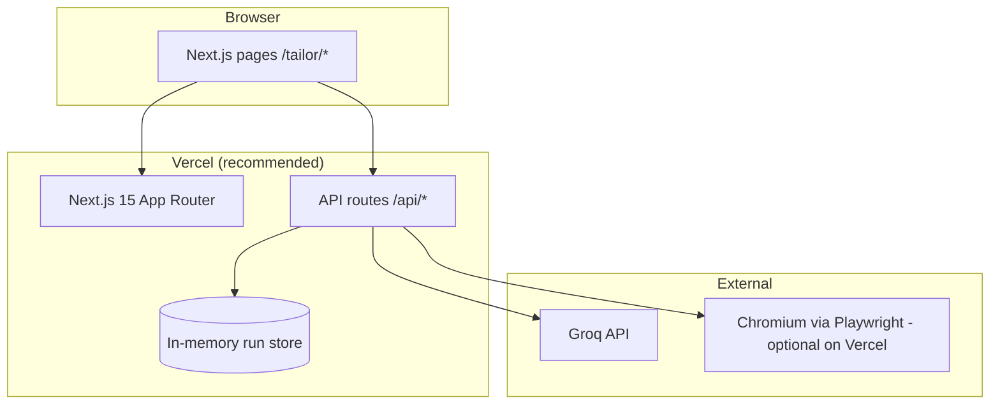

# Deployment plan — Resume Shapeshifter

This document is the **canonical deployment plan** for hosting the project in production. It covers target architecture, prerequisites, Vercel setup, environment configuration, serverless constraints, verification, and known limitations.

For a shorter quick-reference, see [deploy.md](./deploy.md).

---

## 1. Goals and scope

| Goal | In scope (MVP) | Out of scope (MVP) |
|------|----------------|---------------------|
| Public portfolio demo | Next.js UI + API on Vercel | Multi-tenant auth |
| LLM tailoring via Groq | Server-side `GROQ_API_KEY` | User-managed API keys |
| Analyze → tailor → review flow | In-memory run store + client-held run state | Durable DB (`DATABASE_URL`) |
| PDF export | Best-effort on Vercel; reliable locally | Dedicated PDF microservice |

**Success criteria for a production demo deploy:**

1. `/` and `/tailor` load over HTTPS.
2. **Load demo (portfolio)** → **Analyze** → **Generate tailored resume** complete without 5xx.
3. Review page shows diffs and guardrail warnings.
4. PDF export either works on Vercel **or** is documented as local-only for the live URL.

---

## 2. Target architecture



| Component | Technology | Host |
|-----------|------------|------|
| Frontend + API | Next.js 15 (App Router) | Vercel |
| LLM | Groq (OpenAI-compatible) | Groq cloud |
| PDF | Playwright + Chromium | Same Vercel functions (constrained) or local dev |
| Persistence | In-memory `Map` | Per serverless instance (ephemeral) |

**Alternative topology (future):** Vercel for UI + API; Railway/Fly worker for PDF-only, or external `react-pdf` renderer. See [architecture.md §13](./architecture.md#13-deployment-topology).

---

## 3. Prerequisites

### 3.1 Accounts and access

- [ ] Git repository connected to Vercel (GitHub/GitLab/Bitbucket).
- [ ] [Groq Console](https://console.groq.com) API key with sufficient quota for demo traffic.
- [ ] Vercel team/project with **Pro** (or higher) if you need function durations above Hobby limits (see §6).

### 3.2 Local validation (run before first deploy)

```bash
nvm use                    # Node 20 per .nvmrc
npm ci
npm run lint
npm test
npm run build
```

Optional production smoke test locally:

```bash
cp .env.example .env       # set GROQ_API_KEY
npm run start
# http://localhost:3000/tailor → Load demo → Analyze → Tailor → Export
```

For PDF export locally:

```bash
npm run pdf:install          # Chromium for Playwright
```

### 3.3 Secrets policy

- Never commit `.env` or real API keys.
- Set secrets only in the Vercel project **Environment Variables** UI (or CLI).
- `GROQ_API_KEY` must remain server-only (no `NEXT_PUBLIC_` prefix).

---

## 4. Vercel project setup

### 4.1 Import and build settings

| Setting | Value |
|---------|--------|
| Framework preset | Next.js |
| Root directory | `.` (repo root) |
| Build command | `npm run build` (default) |
| Output | Next.js default |
| Install command | `npm ci` or `npm install` |
| Node.js version | **20** (matches `.nvmrc`) |

`vercel.json` configures function memory/timeouts; route files also export `maxDuration` and `runtime = "nodejs"`. **Hobby plan:** max function memory is **2048 MB** (PDF export uses 2048; Pro can raise higher).

### 4.2 Environment variables

Configure for **Production** (and **Preview** if you want PR previews to call Groq).

| Variable | Required | Default | Description |
|----------|----------|---------|-------------|
| `GROQ_API_KEY` | **Yes** | — | Groq API key; server-only |
| `GROQ_BASE_URL` | No | `https://api.groq.com/openai/v1` | OpenAI-compatible base URL |
| `LLM_MODEL` | No | `llama-3.3-70b-versatile` | Model for parse/score/gap/tailor |
| `MAX_UPLOAD_MB` | No | `5` | Max resume upload size (MB) |
| `API_RATE_LIMIT_PER_MIN` | No | `10` | Per-IP requests/min on rate-limited routes |
| `PDF_RENDERER` | No | `playwright` | Only `playwright` is implemented |
| `AWS_LAMBDA_JS_RUNTIME` | No | — | Optional on Vercel: `nodejs22.x` if Chromium fails to start |
| `DATABASE_URL` | No | — | Reserved; not used in MVP |

Copy from [.env.example](../.env.example) when creating local or Vercel env entries.

### 4.3 Deploy steps

1. **Import** the Git repository in Vercel.
2. Confirm **Next.js** preset and **Node 20**.
3. Add environment variables (§4.2); at minimum `GROQ_API_KEY`.
4. Trigger **Deploy** (production branch, typically `main`).
5. After deploy, run the [post-deploy verification](#7-post-deploy-verification) checklist.

### 4.4 Custom domain (optional)

1. Add domain in Vercel → **Domains**.
2. Update DNS per Vercel instructions.
3. Re-run smoke tests on the custom URL (same-origin API routes need no extra CORS config for the default Next.js setup).

---

## 5. What runs on Vercel

### 5.1 Pages (static / SSR)

| Route | Purpose |
|-------|---------|
| `/` | Landing |
| `/tailor` | Input: paste/upload resume + JD |
| `/tailor/[runId]/analysis` | Scores, gaps, trigger tailor |
| `/tailor/[runId]/review` | Side-by-side diff, guardrails |
| `/tailor/[runId]/export` | PDF download + verification checkbox |

### 5.2 API routes

| Route | `maxDuration` | `runtime` | Rate limited |
|-------|---------------|-----------|--------------|
| `POST /api/analyze` | 120s | default | No |
| `POST /api/tailor` | **180s** | default | Yes |
| `POST /api/parse/jd` | 60s | default | No |
| `POST /api/parse/resume` | 60s | `nodejs` | No |
| `POST /api/export/pdf` | 120s | `nodejs` | Yes |
| `GET /api/runs/[id]` | default | default | No |
| `GET /api/health` | default | `nodejs` | No |

Without `GROQ_API_KEY`, LLM routes return `503` with code `LLM_NOT_CONFIGURED` (no stack traces to clients).

### 5.3 Stateful behavior on serverless

**Run store** (`lib/run-store.ts`) is an in-process `Map`:

- Not shared across serverless instances.
- Cleared on cold starts and redeploys.

**Mitigations already in the app:**

- Client keeps run state in React Query / navigation between steps.
- PDF export sends the **full `run` object** in the request body (`hooks/useExportPdf.ts`), so export does not depend on the server still holding the run.

**Rate limiting** (`lib/rate-limit.ts`) is also in-memory per instance; effective limits may be looser than `API_RATE_LIMIT_PER_MIN` under high concurrency. Acceptable for a public demo; use Redis/KV before a multi-instance production launch.

---

## 6. Serverless constraints and plan requirements

### 6.1 Function duration

The codebase requests long-running functions:

| Route | `maxDuration` in code |
|-------|------------------------|
| `/api/tailor` | 180 seconds |
| `/api/analyze` | 120 seconds |
| `/api/export/pdf` | 120 seconds |

**Action:** Confirm your Vercel plan supports the configured `maxDuration` for these routes. Hobby-tier limits are often **10s** (insufficient for full tailor). **Pro** typically allows up to **60s** by default and higher caps when configured in the dashboard.

If tailor consistently times out in production:

1. Upgrade plan / increase function max duration in Vercel.
2. Or split orchestration into smaller API calls (future work).

### 6.2 PDF export (Playwright + Chromium)

| Risk | Detail |
|------|--------|
| Bundle size | `playwright` + Chromium exceeds many serverless bundle limits |
| Cold start | Browser launch is slow and memory-heavy |
| Timeout | PDF route allows 120s but may still fail under memory pressure |

**Serverless PDF (implemented):** On Vercel, `lib/pdf/launch-browser.ts` uses `playwright-core` + `@sparticuz/chromium` instead of a system Chromium install.

**Recommended strategies (pick one for launch):**

| Strategy | When to use | Steps |
|----------|-------------|--------|
| **A. Full Vercel demo** | You have Pro + long timeout + PDF works in preview deploy | Deploy as-is; hit `GET /api/health`; test export on preview URL |
| **B. Vercel without PDF** | PDF fails on Vercel | Deploy UI + LLM; document “export PDF locally” in demo link/README |
| **C. Local portfolio recording** | Recording [demo-script.md](./demo-script.md) | `npm run dev` + `npm run pdf:install` on your machine |
| **D. External PDF worker** | Production-grade PDF | Future: separate Node service or `react-pdf` renderer |

The export API is designed for strategy B: client sends `run` in the body so server store eviction does not block export when Chromium is available.

### 6.3 Dependencies marked external

`next.config.ts` sets `serverExternalPackages: ["pdf-parse", "mammoth"]` so resume parsing works in the serverless bundle. Playwright is not externalized; treat PDF as a special case (§6.2).

---

## 7. Post-deploy verification

Run on the **production URL** after the first successful deploy.

### 7.1 Core flow (required)

- [ ] `GET /api/health` returns `llmConfigured: true` when `GROQ_API_KEY` is set.
- [ ] Home page loads (`/`).
- [ ] `/tailor` loads; **Load demo (portfolio)** fills inputs.
- [ ] **Analyze** completes; redirects to `/tailor/[runId]/analysis`.
- [ ] Analysis shows JD summary, match score, and gaps.
- [ ] **Generate tailored resume** completes; review page loads.
- [ ] Review shows bullet diffs and any guardrail warnings.
- [ ] No `503` / `LLM_NOT_CONFIGURED` (confirms `GROQ_API_KEY`).

### 7.2 PDF export (conditional)

- [ ] On export page, check verification checkbox.
- [ ] Download **Comparison PDF** and/or **Tailored PDF**.
- [ ] If export fails: note error in Vercel function logs; fall back to strategy B or C (§6.2).

### 7.3 Resilience checks (recommended)

- [ ] Second analyze from a new browser session (cold start).
- [ ] Upload a small PDF/DOCX under `MAX_UPLOAD_MB`.
- [ ] Exceed rate limit on `/api/tailor` (expect `429` / `RATE_LIMITED`) if testing abuse protection.

### 7.4 Logs

In Vercel → **Logs**, filter by:

- `event: llm_stage_complete` — stage timing and token fields (no full resume/JD).
- `runId` — trace one tailoring session end-to-end.

---

## 8. Production configuration decisions

### 8.1 Guardrails and export blocking

`lib/guardrails.ts`:

```ts
export const BLOCK_EXPORT_ON_CRITICAL = false; // MVP: warn-only
```

| Setting | Behavior |
|---------|----------|
| `false` (default) | Critical issues show in UI; PDF API may still run if user checks verification |
| `true` | `POST /api/export/pdf` returns error when critical guardrail issues exist |

Decide before a public demo whether warn-only is acceptable for your portfolio narrative.

### 8.2 Rate limits

Default: **10 requests/minute per IP** per route for:

- `POST /api/tailor`
- `POST /api/export/pdf`

Adjust `API_RATE_LIMIT_PER_MIN` for expected demo traffic. Remember limits are per serverless instance (§5.3).

### 8.3 Upload size

`MAX_UPLOAD_MB` (default `5`) applies to resume file uploads. Lower it if you want stricter serverless memory behavior; raise only if Vercel memory allows.

---

## 9. Observability and operations

| Signal | Where | Notes |
|--------|-------|-------|
| Build failures | Vercel Deployments | Fix with local `npm run build` |
| Runtime errors | Vercel Functions logs | Search by `runId` |
| LLM failures | Logs + API `error` codes | Groq `429` → backoff; `401` → rotate key |
| Rate limits | HTTP `429`, code `RATE_LIMITED` | Client retry after `retryAfterSec` |

**Do not log** full resume or JD text in production. The logger is structured for stage metadata only.

---

## 10. Security checklist

- [ ] `GROQ_API_KEY` only in Vercel env (not in git).
- [ ] No secrets in client bundles (`NEXT_PUBLIC_*` must not include API keys).
- [ ] `API_RATE_LIMIT_PER_MIN` set for public URL.
- [ ] `MAX_UPLOAD_MB` and MIME validation respected on upload route.
- [ ] Review `BLOCK_EXPORT_ON_CRITICAL` for portfolio ethics story.
- [ ] Preview deployments: use separate Groq key or stricter rate limits if exposed publicly.

---

## 11. Rollback and troubleshooting

| Symptom | Likely cause | Fix |
|---------|--------------|-----|
| `503` / `LLM_NOT_CONFIGURED` | Missing `GROQ_API_KEY` on Vercel | Add env var; redeploy |
| Analyze/tailor timeout | Function max duration / plan | Upgrade Vercel plan; check `maxDuration` |
| `404` on `GET /api/runs/[id]` | Run not on this instance | Expected; client should use in-app state |
| PDF export 500 / OOM | Playwright on serverless | Use §6.2 strategy B or C |
| `429` / `RATE_LIMITED` | Rate limit hit | Wait or raise `API_RATE_LIMIT_PER_MIN` |
| Groq `429` | Groq quota | Retry; reduce demo traffic |

**Rollback:** Vercel → Deployments → promote previous successful deployment.

---

## 12. CI/CD (recommended, not in repo yet)

The repo does not include GitHub Actions today. Recommended pipeline before auto-deploy:

```yaml
# Suggested steps for a future .github/workflows/ci.yml
- npm ci
- npm run lint
- npm test
- npm run build
```

Wire Vercel **Production** deploys to pass CI on `main` when CI is added.

---

## 13. Deployment phases

Use this sequence for a controlled first production launch.

| Phase | Activities | Owner sign-off |
|-------|------------|----------------|
| **0 — Local** | `npm test`, `npm run build`, local `npm run start` smoke | Dev |
| **1 — Preview** | Vercel preview deploy + `GROQ_API_KEY` in Preview env | Dev |
| **2 — Core API** | Demo analyze + tailor on preview URL | Dev |
| **3 — PDF** | Test export on preview; document fallback if fail | Dev |
| **4 — Production** | Promote to production domain; run §7 checklist | Dev |
| **5 — Demo** | Record or share URL using [demo-script.md](./demo-script.md) | Portfolio |

---

## 14. Future improvements

| Item | Benefit |
|------|---------|
| `DATABASE_URL` + persistent runs | Survive cold starts; share links reliably |
| Vercel KV / Redis rate limits | Accurate global rate limiting |
| External PDF service or `react-pdf` | Reliable export on serverless |
| Health check gate in CI | Wire `GET /api/health` into deploy smoke tests |
| GitHub Actions CI | Block broken builds before Vercel |

---

## 15. Related documents

| Document | Use |
|----------|-----|
| [deploy.md](./deploy.md) | Short Vercel quick-start |
| [demo-script.md](./demo-script.md) | Portfolio recording script |
| [manual-test-phase3.md](./manual-test-phase3.md) | PDF export manual tests |
| [architecture.md](./architecture.md) | System design and topology |
| [edge-cases/phase-5-edge-cases.md](./edge-cases/phase-5-edge-cases.md) | Deploy-related edge cases |

---

## Appendix A — Environment template

```bash
# Production / Preview (Vercel dashboard)
GROQ_API_KEY=<from Groq console>
GROQ_BASE_URL=https://api.groq.com/openai/v1
LLM_MODEL=llama-3.3-70b-versatile
MAX_UPLOAD_MB=5
API_RATE_LIMIT_PER_MIN=10
PDF_RENDERER=playwright
```

## Appendix B — One-page launch checklist

- [ ] Groq API key created and funded
- [ ] Local `npm run build` and `npm test` pass
- [ ] Vercel project: Node 20, Next.js preset
- [ ] `GROQ_API_KEY` set (Production + Preview if needed)
- [ ] Deploy succeeded
- [ ] §7 core flow passes on production URL
- [ ] PDF strategy chosen and documented (§6.2)
- [ ] Demo script rehearsed with production or local URL
