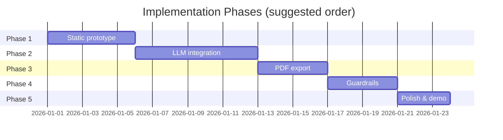
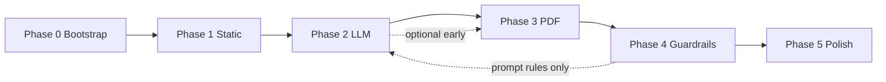

# Resume Shapeshifter — Phase-Wise Implementation Plan

This plan operationalizes [`architecture.md`](./architecture.md) into five implementation phases. Each phase has objectives, tasks, deliverables, acceptance criteria, and exit gates before starting the next phase.

**Stack (fixed for all phases):** Next.js (App Router), React, TypeScript, Tailwind CSS, Shadcn UI, Zod, **Groq** (via OpenAI-compatible API and the `openai` npm client).

**Guiding principle:** Ship a working vertical slice early, then replace mocks with real services without rewriting the UI contract.

---

## Overview



| Phase | Name | Outcome |
|-------|------|---------|
| **1** | Static prototype | Paste-only flow, mocked pipeline, full UI shell |
| **2** | LLM integration | Real parse, score, gap, tailor via API + orchestrator |
| **3** | PDF export | Tailored + comparison PDFs from `TailoringRun` |
| **4** | Guardrails | Truthfulness checks, risk flags, export confirmation |
| **5** | Polish | Demo-ready UX, samples, errors, portfolio artifact |

---

## Phase 0 — Project Bootstrap (prerequisite)

Complete once before Phase 1. Not counted as a product phase but required for all subsequent work.

### Tasks

| # | Task | Owner layer |
|---|------|-------------|
| 0.1 | `npx create-next-app@latest` with TypeScript, Tailwind, App Router, `src/` or flat `app/` per preference | Tooling |
| 0.2 | Install: `zod`, `@tanstack/react-query`, `openai` (Groq-compatible client), `uuid`, Shadcn UI (`npx shadcn@latest init`) | Tooling |
| 0.3 | Add `.env.example` with `GROQ_API_KEY`, `GROQ_BASE_URL`, `LLM_MODEL`, `MAX_UPLOAD_MB` | Config |
| 0.4 | Create folder skeleton per architecture §15 (`app/`, `components/`, `lib/`, `services/`, `prompts/`, `tests/fixtures/`) | Repo |
| 0.5 | Define all Zod schemas in `lib/schemas.ts` (`ResumeProfile`, `JobDescriptionProfile`, `MatchScore`, `TailoredResume`, `GapAnalysis`, `TailoringRun`) | Domain |
| 0.6 | Add `tests/schemas.test.ts` — valid/invalid fixture parsing | Tests |
| 0.7 | Add `tests/fixtures/sample-resume.json`, `sample-jd.json`, `mock-tailoring-run.json` | Fixtures |

### Exit gate

- [ ] `npm run dev` starts without errors
- [ ] Schemas compile and unit tests pass
- [ ] README documents env vars and `npm run dev`

---

## Phase 1 — Static Prototype

**Architecture focus:** Component tree, domain types, mock orchestrator, in-browser side-by-side. No LLM, no PDF, no file upload.

**Duration (estimate):** 3–5 days

### Objectives

1. Prove the full user journey in the UI with realistic mock data.
2. Lock component props and `TailoringRun` shape before backend work.
3. Enable design/UX iteration without API cost.

### Tasks

#### 1.1 Domain & mocks

| # | Task | File(s) |
|---|------|---------|
| 1.1.1 | Implement `lib/mock-orchestrator.ts` returning a complete `TailoringRun` from pasted text (ignore content; return fixture) | `lib/mock-orchestrator.ts` |
| 1.1.2 | Heuristic “parse” for display only: split resume text into fake sections (optional) | `lib/heuristic-resume.ts` |
| 1.1.3 | Export `createMockTailoringRun(resumeText, jdText): TailoringRun` | `lib/mock-orchestrator.ts` |

#### 1.2 Frontend — single-page vertical slice (preferred for speed)

| # | Task | File(s) |
|---|------|---------|
| 1.2.1 | Landing page with CTA → `/tailor` | `app/page.tsx` |
| 1.2.2 | `/tailor` — stepped sections: Input → Analysis → Review → Export (stub) | `app/tailor/page.tsx` |
| 1.2.3 | `ResumeInput` — textarea only (paste) | `components/ResumeInput.tsx` |
| 1.2.4 | `JDInput` — textarea | `components/JDInput.tsx` |
| 1.2.5 | `ScoreCard` — original score; placeholder for tailored | `components/ScoreCard.tsx` |
| 1.2.6 | `JDRequirementsSummary` — skills, tools, seniority from mock JD profile | `components/JDRequirementsSummary.tsx` |
| 1.2.7 | `GapAnalysis` — list with importance badges | `components/GapAnalysis.tsx` |
| 1.2.8 | `SideBySideDiff` — two columns, highlight changed lines | `components/SideBySideDiff.tsx` |
| 1.2.9 | `BulletChangeCard` — reason, keywords, confidence, risk (mock) | `components/BulletChangeCard.tsx` |
| 1.2.10 | Wire “Analyze” / “Generate tailored resume” to mock orchestrator + `sessionStorage` | `hooks/useTailoringRun.ts` |
| 1.2.11 | Generate client `runId` (uuid); persist run to `sessionStorage` | `hooks/useTailoringRun.ts` |

#### 1.3 UI/UX baseline

| # | Task |
|---|------|
| 1.3.1 | App layout: header, footer, disclaimer snippet on tailor page |
| 1.3.2 | Basic responsive layout for side-by-side (stack on mobile) |
| 1.3.3 | Disabled states when resume or JD empty |

#### 1.4 Stub API routes (optional but recommended)

Return static JSON from fixtures so Phase 2 only swaps implementation:

| # | Task | File(s) |
|---|------|---------|
| 1.4.1 | `POST /api/analyze` → fixture `analyze-response.json` | `app/api/analyze/route.ts` |
| 1.4.2 | `POST /api/tailor` → fixture `tailor-response.json` | `app/api/tailor/route.ts` |
| 1.4.3 | Frontend calls API instead of direct mock import | `hooks/useTailoringRun.ts` |

### Deliverables

- Runnable app: paste resume + JD → analyze → review side-by-side (mock data).
- Shared types consumed by components.
- Fixture-backed API stubs (if 1.4 completed).

### Acceptance criteria

- [ ] User can paste resume and JD and click **Analyze**
- [ ] UI shows JD summary, original match score (mock), and gap list (mock)
- [ ] User can click **Generate tailored resume** and see side-by-side bullets with change metadata
- [ ] Refresh restores run from `sessionStorage` (same `runId`)
- [ ] All displayed data validates against Zod schemas
- [ ] No API keys required to run Phase 1

### Exit gate → Phase 2

- [ ] Component APIs frozen (props documented or inferred from usage)
- [ ] `TailoringRun` JSON shape matches architecture §4
- [ ] Team agrees on single-page vs split routes (recommend deferring route split until Phase 5)

---

## Phase 2 — LLM Integration (Groq)

**Architecture focus:** Groq-backed prompt modules, Zod validation, real services, orchestrator, API routes. Paste text only; file upload deferred to Phase 5.

**Duration (estimate):** 5–7 days

**Prerequisites:** Groq API key from [console.groq.com](https://console.groq.com); set `GROQ_API_KEY` in `.env`.

### Objectives

1. Replace mocks with real Groq-backed parse, score, gap, and tailor.
2. Implement orchestrator workflow: parse → score → gap → tailor → re-score.
3. Enforce structured JSON + single retry on validation failure.

### Tasks

#### 2.1 LLM infrastructure (Groq)

| # | Task | File(s) |
|---|------|---------|
| 2.1.1 | `lib/llm/client.ts` — `OpenAI` client with `baseURL: https://api.groq.com/openai/v1`, `GROQ_API_KEY`, `LLM_MODEL` (default `llama-3.3-70b-versatile`) | `lib/llm/client.ts` |
| 2.1.2 | `lib/llm/run-prompt.ts` — chat completion + `response_format: json_object` when supported + fence strip + Zod parse + one retry | `lib/llm/run-prompt.ts` |
| 2.1.3 | Shared system preamble: truthfulness rules (architecture §6) | `prompts/system.ts` |
| 2.1.4 | Map Groq errors: `401` → `LLM_AUTH_FAILED`, `429` → backoff + `LLM_RATE_LIMIT`, timeout → `LLM_TIMEOUT` | `lib/llm/run-prompt.ts` |

#### 2.2 Prompts (one file per task)

| # | Task | Output schema |
|---|------|---------------|
| 2.2.1 | `prompts/jd-extraction.ts` | `JobDescriptionProfile` |
| 2.2.2 | `prompts/resume-parser.ts` | `ResumeProfile` |
| 2.2.3 | `prompts/match-scoring.ts` | `MatchScore` |
| 2.2.4 | `prompts/gap-analysis.ts` | `GapAnalysis` |
| 2.2.5 | `prompts/bullet-rewriter.ts` | `TailoredBullet[]` per batch |
| 2.2.6 | `prompts/final-assembly.ts` (optional) | summary + skills ordering |

#### 2.3 Services

| # | Task | File(s) |
|---|------|---------|
| 2.3.1 | `services/jd-parser.ts` — JD text → profile via `jd-extraction` | `services/jd-parser.ts` |
| 2.3.2 | `services/resume-parser.ts` — plain text → heuristic sections → `resume-parser` LLM cleanup | `services/resume-parser.ts` |
| 2.3.3 | `lib/scoring.ts` — deterministic skill overlap helpers to seed match prompt | `lib/scoring.ts` |
| 2.3.4 | `services/match-engine.ts` — hybrid deterministic + `match-scoring` | `services/match-engine.ts` |
| 2.3.5 | `services/gap-engine.ts` — `gap-analysis` prompt | `services/gap-engine.ts` |
| 2.3.6 | `services/tailoring-engine.ts` — batch bullets by role, merge, optional `final-assembly` | `services/tailoring-engine.ts` |
| 2.3.7 | `lib/orchestrator.ts` — full workflow per architecture §5.6 | `lib/orchestrator.ts` |
| 2.3.8 | In-memory `Map<runId, TailoringRun>` store for server session (MVP) | `lib/run-store.ts` |

#### 2.4 API routes

| # | Task | File(s) |
|---|------|---------|
| 2.4.1 | `POST /api/parse/resume` — body `{ text }` | `app/api/parse/resume/route.ts` |
| 2.4.2 | `POST /api/parse/jd` — body `{ text }` | `app/api/parse/jd/route.ts` |
| 2.4.3 | `POST /api/analyze` — parse both, `originalMatch`, `gapAnalysis`, persist run, `status: analyzed` | `app/api/analyze/route.ts` |
| 2.4.4 | `POST /api/tailor` — `{ runId }`, run tailor + `tailoredMatch`, `status: tailored` | `app/api/tailor/route.ts` |
| 2.4.5 | `GET /api/runs/[id]` — return run or 404 | `app/api/runs/[id]/route.ts` |
| 2.4.6 | Standard error shape `{ error, code, details? }` | all routes |

#### 2.5 Frontend integration

| # | Task |
|---|------|
| 2.5.1 | Replace mock orchestrator with TanStack Query mutations (`useAnalyze`, `useTailor`) |
| 2.5.2 | Loading skeletons per section during LLM calls |
| 2.5.3 | Display `originalMatch` and post-tailor `tailoredMatch` in `ScoreCard` |
| 2.5.4 | Show API/validation errors with retry button |
| 2.5.5 | Sync `sessionStorage` with server run after each step |

#### 2.6 Tests

| # | Task | File(s) |
|---|------|---------|
| 2.6.1 | Unit tests for `lib/scoring.ts` | `tests/scoring.test.ts` |
| 2.6.2 | Integration test: analyze + tailor with mocked LLM (optional) | `tests/orchestrator.test.ts` |
| 2.6.3 | Manual script or doc: run against real JD + resume once | `docs/manual-test.md` |

### Deliverables

- End-to-end LLM pipeline from pasted text to tailored bullets and both match scores.
- Six prompt modules with Zod-validated outputs.
- Working `/api/analyze` and `/api/tailor`.

### Acceptance criteria

- [ ] Paste real resume + real JD → **Analyze** returns extracted JD requirements, original score with explanation, and gaps
- [ ] **Generate tailored resume** returns rewritten bullets with `changeReason`, `keywordsAddressed`, `confidence`
- [ ] Tailored match score ≥ original score for demo fixture (not guaranteed for all inputs, but demo path should improve)
- [ ] Invalid LLM JSON triggers one retry; second failure returns clear error to UI
- [ ] `GET /api/runs/:id` returns full `TailoringRun`
- [ ] No Groq API keys exposed to client

### Exit gate → Phase 3

- [ ] Orchestrator matches architecture pseudocode (parse → score → gap → tailor → re-score)
- [ ] At least one successful run recorded for demo resume + JD pair
- [ ] Token/latency acceptable for demo (&lt; ~60s total acceptable for MVP)

---

## Phase 3 — PDF Export

**Architecture focus:** HTML templates, PDF generator service, export API, download UX.

**Duration (estimate):** 3–4 days

### Objectives

1. Generate **tailored resume PDF** and **side-by-side comparison PDF** from `TailoringRun`.
2. Make comparison PDF the portfolio proof artifact (scores, gaps, disclaimer, highlights).

### Tasks

#### 3.1 PDF stack decision

| Option | When to use |
|--------|-------------|
| **Playwright** (recommended) | Full CSS control, diff highlighting, local dev + Node server |
| `@react-pdf/renderer` | If Playwright blocked on serverless |

| # | Task |
|---|------|
| 3.1.1 | Install Playwright (or Puppeteer); document `npx playwright install chromium` |
| 3.1.2 | Add `PDF_RENDERER` env; abstract behind `lib/pdf/renderer.ts` |

#### 3.2 Templates

| # | Task | File(s) |
|---|------|---------|
| 3.2.1 | `templates/tailored-resume.html` — single column, ATS-friendly | `templates/` |
| 3.2.2 | `templates/comparison-pdf.html` — header, scores, JD summary, two columns, gap table, footer disclaimer | `templates/comparison-pdf.html` |
| 3.2.3 | Template data builder: `TailoringRun` → HTML context object | `lib/pdf/build-context.ts` |
| 3.2.4 | Highlight changed bullets via `<mark>` using `TailoredBullet` metadata | `lib/pdf/build-context.ts` |

#### 3.3 Service & API

| # | Task | File(s) |
|---|------|---------|
| 3.3.1 | `services/pdf-generator.ts` — `generateTailoredPdf(run)`, `generateComparisonPdf(run)` | `services/pdf-generator.ts` |
| 3.3.2 | `POST /api/export/pdf` — body `{ runId, types: ['tailored','comparison'] }` → binary or base64 + filename | `app/api/export/pdf/route.ts` |
| 3.3.3 | Set `TailoringRun.status = 'exported'` on success | orchestrator or route |
| 3.3.4 | Handle serverless limits: max duration, Chromium bundle (document workaround if on Vercel) | README |

#### 3.4 Frontend

| # | Task | File(s) |
|---|------|---------|
| 3.4.1 | `PDFExportButton` — triggers export, shows loading | `components/PDFExportButton.tsx` |
| 3.4.2 | Export section on tailor page (or `/tailor/[runId]/export`) | page |
| 3.4.3 | Browser download via blob + `download` attribute | hook |
| 3.4.4 | Static disclaimer text before download (full guardrail checkbox in Phase 4) | component |

### Deliverables

- Two downloadable PDFs per tailoring run.
- Comparison PDF includes all sections in architecture §10.1.

### Acceptance criteria

- [ ] Export produces **tailored resume PDF** readable and properly sectioned
- [ ] Export produces **comparison PDF** with: job title/company, original vs tailored scores, JD summary, side-by-side bullets, highlighted changes, gap summary, disclaimer
- [ ] PDF reflects latest `TailoringRun` from server store or request body
- [ ] Export fails gracefully with user-visible error (e.g., Chromium missing)

### Exit gate → Phase 4

- [ ] Demo comparison PDF saved and reviewed for portfolio quality
- [ ] PDF generation works in target deploy environment (or documented local-only export)

---

## Phase 4 — Guardrails & Validation

**Architecture focus:** `guardrails.ts` service, confidence/risk in UI, unsupported-claim detection, export confirmation.

**Duration (estimate):** 3–4 days

### Objectives

1. Reduce fabrication and overstatement risk after LLM output.
2. Surface trust signals in UI before export.
3. Require explicit user acknowledgment before PDF download.

### Tasks

#### 4.1 Guardrail checker (deterministic)

| # | Task | File(s) |
|---|------|---------|
| 4.1.1 | `lib/guardrails.ts` — `checkTailoredResume(original, tailored): GuardrailResult` | `lib/guardrails.ts` |
| 4.1.2 | Detect new employers/titles not in source | function |
| 4.1.3 | Detect new degrees/certifications | function |
| 4.1.4 | Detect new numeric metrics in bullets (regex + allowlist from originals) | function |
| 4.1.5 | Detect technologies in tailored text absent from resume (flag, don’t auto-strip in MVP) | function |
| 4.1.6 | Keyword density spike heuristic | function |
| 4.1.7 | Merge results: set `riskFlag`, downgrade `confidence` on bullets | `services/tailoring-engine.ts` post-process |

#### 4.2 Orchestrator integration

| # | Task |
|---|------|
| 4.2.1 | Run guardrails after tailor, before `tailoredMatch` |
| 4.2.2 | Attach `warnings: string[]` to `/api/tailor` response |
| 4.2.3 | Block export if critical violations (configurable; start with warn-only) |

#### 4.3 Prompt hardening

| # | Task |
|---|------|
| 4.3.1 | Audit all prompts for truthfulness system message |
| 4.3.2 | Add examples of forbidden transformations to `bullet-rewriter` |
| 4.3.3 | Stricter Zod: e.g., `tailored` min length, `original` required match |

#### 4.4 UI

| # | Task | File(s) |
|---|------|---------|
| 4.4.1 | Highlight low-confidence and risk-flagged bullets in `SideBySideDiff` | components |
| 4.4.2 | Warnings banner when `warnings.length > 0` | component |
| 4.4.3 | Export modal: checkbox “I have verified all content is truthful” (required) | `PDFExportButton.tsx` |
| 4.4.4 | Include disclaimer in comparison PDF footer (verify Phase 3 template) | template |

#### 4.5 Tests

| # | Task | File(s) |
|---|------|---------|
| 4.5.1 | `tests/guardrails.test.ts` — fabricated employer, new metric, new skill | tests |
| 4.5.2 | Fixture: “bad” tailored output triggers expected warnings | fixtures |

### Deliverables

- Guardrail pipeline integrated into tailor flow.
- User-facing risk/confidence affordances and export gate.

### Acceptance criteria

- [ ] Injecting a fabricated employer in test fixture triggers warning/block
- [ ] New metrics not in original bullet receive `riskFlag`
- [ ] Low-confidence bullets visually distinct in review UI
- [ ] PDF export disabled until user checks verification box
- [ ] Comparison PDF footer contains truthfulness + no-ATS-guarantee disclaimer

### Exit gate → Phase 5

- [ ] Guardrail unit tests pass
- [ ] Manual review: tailored output for demo JD has no high-severity warnings unchecked

---

## Phase 5 — Polish & Demo Readiness

**Architecture focus:** File upload, route split, samples, observability, deployment, portfolio demo.

**Duration (estimate):** 3–5 days

### Objectives

1. Production-quality UX for portfolio demo.
2. Support PDF/DOCX resume upload (architecture §7.1).
3. Split routes, add samples, deploy, and document demo script.

### Tasks

#### 5.1 Document ingestion

| # | Task | File(s) |
|---|------|---------|
| 5.1.1 | `ResumeInput` file upload — PDF (`pdf-parse`), DOCX (`mammoth`) | component + parser |
| 5.1.2 | File size/MIME validation per `MAX_UPLOAD_MB` | API route |
| 5.1.3 | Parse warnings in UI (“section unclear”, “column layout may be wrong”) | component |
| 5.1.4 | Retain `rawText` on run for audit | `TailoringRun` extension |

#### 5.2 Route structure

| # | Task | File(s) |
|---|------|---------|
| 5.2.1 | Split `/tailor` into `/tailor/[runId]/analysis`, `review`, `export` | `app/tailor/[runId]/...` |
| 5.2.2 | Navigation stepper between analysis → review → export | component |
| 5.2.3 | Redirect to analysis after analyze; to review after tailor | pages |

#### 5.3 Demo & samples

| # | Task |
|---|------|
| 5.3.1 | “Load sample resume” / “Load sample JD” buttons (bundled fixtures) |
| 5.3.2 | Curate `tests/fixtures/demo-resume.txt` + `demo-jd.txt` from real listing |
| 5.3.3 | `docs/demo-script.md` — step-by-step demo for portfolio video |

#### 5.4 UX hardening

| # | Task |
|---|------|
| 5.4.1 | Error boundaries on tailor flow |
| 5.4.2 | Empty states, keyboard focus, aria labels on main actions |
| 5.4.3 | Progress indicator for multi-step LLM pipeline (“Parsing…”, “Scoring…”, etc.) |
| 5.4.4 | Optional: rate limit middleware on `/api/tailor`, `/api/export/pdf` |

#### 5.5 Observability & deploy

| # | Task |
|---|------|
| 5.5.1 | Structured logs: stage name, `runId`, duration, token usage (no PII) |
| 5.5.2 | Deploy to Vercel (or chosen host); document PDF constraints |
| 5.5.3 | `.env` production checklist |

#### 5.6 Optional (if time)

| # | Task |
|---|------|
| 5.6.1 | SQLite/Supabase persistence instead of in-memory `run-store` |
| 5.6.2 | Markdown export of tailored resume |
| 5.6.3 | Gap list sort/filter by importance |

### Deliverables

- Portfolio-ready app with sample data one-click load.
- Deployed URL (optional) + local demo path.
- Final comparison PDF artifact from real JD.

### Acceptance criteria (Definition of Done — architecture Appendix B)

- [ ] User can paste or upload resume and paste JD
- [ ] Analyze shows JD requirements, original score, gaps
- [ ] Tailor shows side-by-side bullets with explanations and confidence
- [ ] Tailored score shown and improves on demo path
- [ ] Export downloads tailored + comparison PDFs
- [ ] Comparison PDF is shareable as portfolio proof
- [ ] Sample resume + real JD demo completes in &lt; 2 minutes narrated

---

## Cross-Phase Dependencies



| Dependency | Notes |
|------------|-------|
| Phase 2 depends on Phase 1 | UI contract and schemas must exist |
| Phase 3 depends on Phase 2 | PDF needs real `TailoringRun` |
| Phase 4 can start partial during Phase 2 | Truthfulness prompts should land in Phase 2; deterministic checker in Phase 4 |
| Phase 5 file upload can slip after Phase 3 | Text paste sufficient for PDF demo |

---

## Minimum Vertical Slice (anytime after Phase 2)

If schedule is tight, declare MVP at:

```
POST /api/analyze → POST /api/tailor → Side-by-side UI → POST /api/export/pdf
```

Phases 4–5 can run in parallel: guardrails on API while UI polish proceeds.

---

## Testing Strategy by Phase

| Phase | Unit | Integration | Manual |
|-------|------|-------------|--------|
| 0 | Zod schemas | — | dev server |
| 1 | — | mock API fixtures | click-through UI |
| 2 | scoring helpers | orchestrator (mocked LLM) | real JD + resume |
| 3 | PDF context builder | — | open PDFs visually |
| 4 | guardrails | tailor + guardrails | adversarial prompts |
| 5 | parsers | upload → analyze | full demo script |

---

## Risk Checklist per Phase

| Phase | Top risk | Mitigation |
|-------|----------|------------|
| 1 | UI rework when real data arrives | Use production `TailoringRun` shape in mocks |
| 2 | LLM cost/latency | Batch bullets; `llama-3.1-8b-instant` for dev, `llama-3.3-70b-versatile` for demo; cache JD per run |
| 2 | JSON failures | Zod retry; `json_object` response format; lower temperature |
| 2 | Groq RPM/TPM limits | Batch bullet rewrites; exponential backoff on 429; show retry in UI |
| 3 | Serverless PDF | Playwright on Node runtime or local export fallback |
| 4 | False positives in guardrails | Warn-first; tune heuristics with fixtures |
| 5 | Bad PDF parse | Warnings + paste fallback |

---

## Suggested Milestones & Demos

| Milestone | After phase | Demo |
|-----------|-------------|------|
| **M1 — UI proof** | Phase 1 | Walk through mock analyze + review |
| **M2 — Intelligence** | Phase 2 | Live tailor against real job posting (Groq) |
| **M3 — Artifact** | Phase 3 | Show comparison PDF |
| **M4 — Trust** | Phase 4 | Show risk flag on overstated bullet |
| **M5 — Portfolio** | Phase 5 | End-to-end recorded demo |

---

## File Checklist (cumulative)

Use this as a progress tracker across phases:

```
[ ] lib/schemas.ts
[ ] lib/mock-orchestrator.ts          (Phase 1, remove or keep for tests)
[ ] lib/orchestrator.ts               (Phase 2)
[ ] lib/scoring.ts                    (Phase 2)
[ ] lib/guardrails.ts                 (Phase 4)
[ ] lib/llm/client.ts                 (Phase 2)
[ ] lib/llm/run-prompt.ts             (Phase 2)
[ ] lib/run-store.ts                  (Phase 2)
[ ] lib/pdf/build-context.ts          (Phase 3)
[ ] services/resume-parser.ts         (Phase 2, upload in 5)
[ ] services/jd-parser.ts               (Phase 2)
[ ] services/match-engine.ts          (Phase 2)
[ ] services/gap-engine.ts            (Phase 2)
[ ] services/tailoring-engine.ts      (Phase 2)
[ ] services/pdf-generator.ts         (Phase 3)
[ ] prompts/*.ts                      (Phase 2)
[ ] templates/comparison-pdf.html     (Phase 3)
[ ] app/api/analyze/route.ts          (Phase 1 stub → 2 real)
[ ] app/api/tailor/route.ts           (Phase 1 stub → 2 real)
[ ] app/api/export/pdf/route.ts       (Phase 3)
[ ] components/*                      (Phase 1, enhanced 4–5)
[ ] tests/schemas.test.ts             (Phase 0)
[ ] tests/guardrails.test.ts          (Phase 4)
```

---

## References

- [architecture.md](./architecture.md) — system design, APIs, domain model (see **§6.1 Groq integration**)
- [problemStatement.md](./problemStatement.md) — product requirements and acceptance criteria
- [Groq OpenAI-compatible API](https://console.groq.com/docs/openai) — client setup and models

---

*Update this plan when implementation choices change (e.g., React PDF instead of Playwright, or auth/persistence added).*
